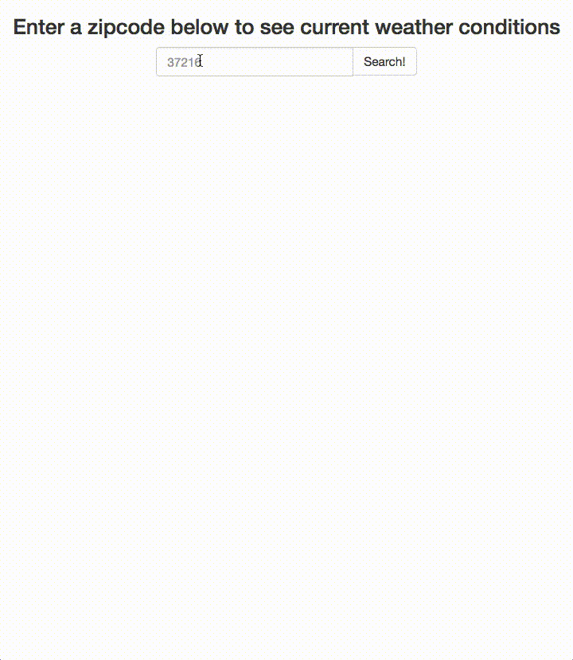

# NSS Exercise: local-weather-app

## Project Description:
> Using https://openweathermap.org and their API docs, create a single page application for a user to enter their zipcode and see weather data for that area,
> After their initial search, let the user choose to see the 3, and 5 day forcast for that zipcode
> The main items the user should see are:
> * Temperature
> * Conditions
> * Air Pressure
> * Wind Speed
> * An affordance to view the forecast for the current day, the next three days, or the next 5 days

## Project Requirements Included:
* Use jQuery, ajax, and Promises to get the weather data from https://openweathermap.org
* Validate that the user did in fact add a US zipcode
* Display the Temperature in imperial measurements
* Use Bootstrap

## Final Product

As a class this was our first dive into using API's. Reading OpenWeatherMap's API docs over and over was a must throughout the project. In the end a quick and simple app to see the current weather conditions was the focus.

## See it in action!

<!--  -->


## How to run it
Must have Node installed first
```
$ git clone https://github.com/alexsanchez728/local-weather-app
$ cd adopt-my-cats/lib/
$ npm install
$ grunt
```

Be sure to get an API key yourself to see the app in its full at:
https://openweathermap.org/api
and place your key in `apiKeys.example.json` here:
```
{
	"apiKeys": {
		"tmdb": {
			"apiKey": "XXXXX"
		}
	}
}
```
Then, open a seperate tab and do the following:
```
$ cd ../
$ npm install http-server -g
$ http-server -p 8080
```

This will show up in your browser at:
`http://localhost:8080`